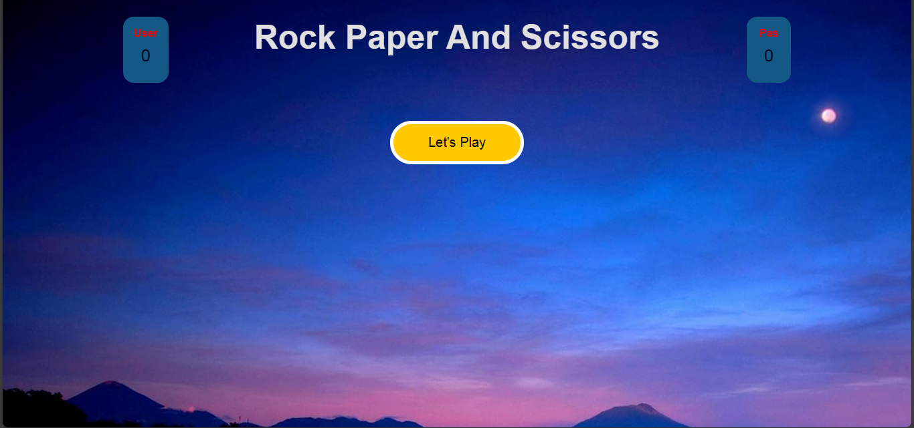
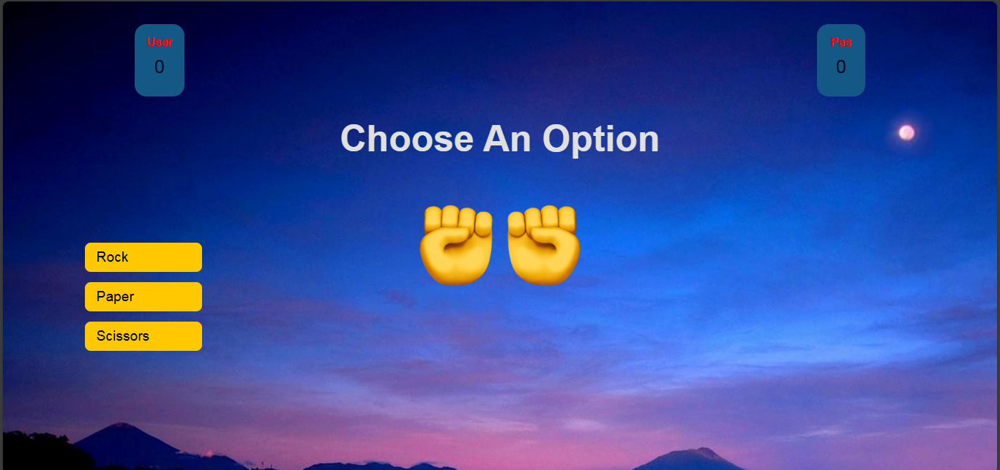

# Rock-Paper-Scissors
Rock-Paper-Scissors is a classic hand game where two players choose from three options: rock, paper, or scissors. The objective is simple: rock beats scissors, scissors beats paper, and paper beats rock. It's a quick and fun test of strategy and intuition.

## Technologies Used
  - HTML
  - CSS
  - Java script

   play https://dasunikayapabandara.github.io/Rock-Paper-Scissors/
